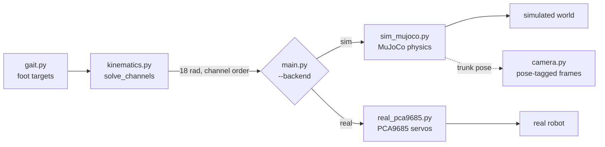
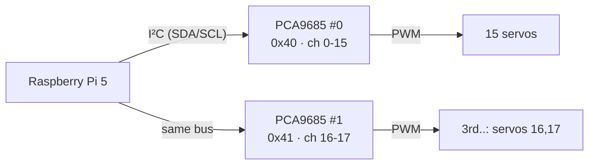

# Hardware Integration — a tutorial (code + concepts)

How the same six-legged robot runs in **MuJoCo** and on **real servos**, driven
by one small package. This walks through every module in `hexapod/` and the
hardware ideas behind it: the 18-channel joint interface, PWM, the PCA9685 over
I²C, radians → servo degrees, open-loop control, and the CSI camera. No prior
robotics needed — just Python.

> Run the whole thing with **no hardware and no display**:
> `python hexapod/main.py --check` → `ALL CHECKS PASSED`.

---

## 0. The one idea

A gait decides *where each foot should be*. Inverse kinematics turns that into
*joint angles*. Something then has to **make the joints move** — either a physics
engine (simulation) or 18 real servos (hardware). The trick that makes this
package small is that both look **identical** to the code above them:

```python
backend.set_joint_targets(targets_rad)   # 18 joint angles, radians
backend.step()                           # advance one control tick
```

So the gait and the kinematics never know whether they are driving pixels or
plastic. You flip one flag:



The seven modules and who owns them:

| module | role | owner |
|---|---|---|
| `robot_config.py` | the one geometry file (legs, ranges, stance) | Data A |
| `kinematics.py` | foot xyz → joint angles → 18 channels | Data A |
| `gait.py` | stand / tripod / wave foot trajectories | Data A |
| `sim_mujoco.py` | MuJoCo backend | Data A |
| `real_pca9685.py` | PCA9685 servo backend (I²C) | **Embedded** |
| `camera.py` | CSI camera + pose-tagging | **Data B** |
| `main.py` | choose sim or real | — |

---

## 1. The 18-channel contract

Eighteen servos = **6 legs × 3 joints** (coxa, femur, tibia). We give every servo
a fixed number so sim, hardware, the RL policy, and the Embedded firmware all
agree on which number is which joint:

```
channel = leg_index * 3 + joint_index
```

Leg order is fixed in `robot_config.LEGS` (front_left, mid_left, back_left,
back_right, mid_right, front_right); joint order is coxa, femur, tibia. So
channel 0 = front_left coxa, channel 1 = front_left femur, … channel 17 =
front_right tibia. This is the exact order in
[`interfaces/servo_conventions.md`](../interfaces/servo_conventions.md) and the
18-dim RL action vector, so nothing ever needs re-indexing.

`kinematics.solve_channels` produces exactly that vector — six `(coxa, femur,
tibia)` triples flattened in leg order:

```python
def solve_channels(foot_targets_body):
    flat = []
    for coxa, femur, tibia in solve_all(foot_targets_body):
        flat.extend((coxa, femur, tibia))
    return flat
```

Everything downstream — sim or real — takes this one list of 18 radians.

> **Concept — why radians, not PWM, cross the boundary.** Data A speaks pure
> geometry (radians). The translation to electrical pulses happens *only* inside
> `real_pca9685.py`. That keeps the robot's "brain" hardware-agnostic: swap
> servos, or move to sim, and the gait code is untouched.

---

## 2. Concept: how a hobby servo actually moves

A hobby servo (like the MG996R) is told its angle by a **PWM** signal — a pulse
repeated 50 times a second (every 20 ms). The **width** of each pulse is the
command:

```
~500 µs  → 0°        ┌┐________________┌┐________________
~1500 µs → 90°       ┌──┐_____________┌──┐_____________
~2500 µs → 180°      ┌────┐___________┌────┐___________
         |<-- 20 ms (50 Hz) -->|
```

The servo has its own internal controller that drives the horn to whatever angle
the pulse width encodes. So "command a servo" = "emit a pulse of the right
width, 50 times a second." Our whole job on the hardware side is: **joint angle
in radians → pulse width**.

> **Concept — open-loop.** A hobby servo gives *no feedback* about where it
> actually ended up. We command an angle and trust it. So the robot's reported
> joint angles are *commanded*, not *measured* — this is **open-loop** control,
> and it is why `pose_stamped.joint_angles_rad` is documented as "commanded."

---

## 3. Concept: PCA9685 + I²C, and why two boards

A Raspberry Pi has no good way to generate 18 precise PWM signals itself. So we
use a **PCA9685**: a chip that generates **16** independent 12-bit PWM channels,
and the Pi talks to it over **I²C** — a simple 2-wire bus (`SDA` = data,
`SCL` = clock). The Pi says "channel 5, this pulse width"; the PCA9685 does the
pulsing.

18 servos > 16 channels, so we use **two PCA9685 boards** on the *same* I²C bus,
at different addresses (`0x40` and `0x41`). Logical channel 0…17 maps to a board
and a pin:

```
board = channel // 16      pin = channel % 16
channels  0..15  → board0 (0x40) pins 0..15
channels 16,17   → board1 (0x41) pins 0,1
```



We drive the boards with Adafruit's high-level `ServoKit`: you set a pulse-width
range once and then just assign **degrees** (`kit.servo[pin].angle = 90`); the
library converts degrees → microseconds → 12-bit ticks for you. That shrinks our
remaining job to: **radians → degrees in [0, 180]**.

---

## 4. Code: the real backend (`real_pca9685.py`)

### radians → servo degrees

Each channel has a calibration entry mapping its joint's radian range onto the
servo's 0–180° travel (`reverse` flips a back-to-front-mounted servo):

```python
def rad_to_servo_deg(ch, rad, cal):
    c = cal[ch]
    lo, hi = c["at_rad"]                      # this joint's rad range
    frac = 0.0 if hi == lo else (rad - lo) / (hi - lo)
    deg = frac * SERVO_TRAVEL_DEG             # 0..180
    if c["reverse"]:
        deg = SERVO_TRAVEL_DEG - deg
    deg += c.get("trim_deg", 0.0)             # per-servo zero offset
    return max(0.0, min(SERVO_TRAVEL_DEG, deg))
```

### writing the frame

`set_joint_targets` converts all 18 and sends each to the right board/pin:

```python
degs = [rad_to_servo_deg(ch, targets_rad[ch], self.cal) for ch in range(self.n)]
for ch in range(min(self.wired, self.n)):
    board, pin = ch // 16, ch % 16
    self._kits[board].servo[pin].angle = degs[ch]
```

`self.wired` supports **incremental bring-up**: wire 3 servos (one leg), test,
then 15 (`board0`), then all 18. `--channels 3` on the command line drives only
the first leg.

### it runs with nothing attached

If `adafruit_servokit` (or the I²C bus) is missing, the backend flips to
**dry-run**: it does *all* the same math and prints the channel table, driving
nothing. That means the exact hardware code path is exercised on a laptop:

```
$ python hexapod/real_pca9685.py
  ch  leg         joint  board pin   stance_deg
   0  front_left  coxa   0x40   0     90.0
   1  front_left  femur  0x40   1    124.9
   2  front_left  tibia  0x40   2     29.2
  ...
  16  front_right femur  0x41   0    124.9
  17  front_right tibia  0x41   1     29.2
```

### the range caveat (a real hardware fact)

`robot_config.py` asks for **femur 210°** (−90…+120) and **tibia 190°**
(−170…+20), but a standard MG996R only travels **~180°**. The backend flags
every channel that exceeds the servo's travel:

```
[warn] ch1: joint travel 210 deg > 180 deg servo (needs 270 deg servo, gearing, or a clamped range)
```

That is not a bug — it is the backend telling you the truth about your parts.
Fixes: 270° servos, gearing, or clamp the ranges in `robot_config.py` before
bring-up. (Coxa's 100° is fine.)

---

## 5. Code: the sim backend (`sim_mujoco.py`)

The simulation implements the *same* interface, so `main.py` can't tell them
apart. It builds the robot's MuJoCo model straight from `robot_config.py` (no
hand-edited XML), then:

```python
def set_joint_targets(self, targets_rad):
    for aid, val in zip(self._ctrl_ids, targets_rad):   # ctrl ids in channel order
        self.data.ctrl[aid] = val

def step(self):
    self.mj.mj_step(self.model, self.data)              # advance the physics
```

MuJoCo has real position servos with a `kp` gain, gravity, contact and friction,
so a bad gait *falls over in sim* — you catch mistakes before they reach a real
robot. The sim backend also exposes the trunk **pose** (position + orientation
quaternion), which the camera uses next.

> **Concept — sim-to-real.** Sim and hardware share `robot_config.py` and the
> 18-channel interface, so a gait (or a trained policy) developed in MuJoCo maps
> onto the servos with no code changes. The gaps that remain are physical:
> servo travel (§4), open-loop error (§2), timing, and friction.

---

## 6. Code: the CSI camera (`camera.py`)

The vision sensor is a CSI camera (e.g. ArduCam) on the Pi 5, read with
`picamera2`. The CSI ribbon carries power, ground, I²C (sensor config), the data
lanes and the clock on one cable. Data A never processes pixels — but this is
where the **Data B contract** lives: attach the freshest robot **pose** and a
**timestamp** to each frame so detections can be placed in space.

```python
def capture_tagged(self, pose_provider=None):
    stamp_ms = _now_ms()                 # one clock for frame + pose
    frame = self.get_frame()
    pose = pose_provider() if pose_provider else None
    self._frame_id += 1
    return {"robot_id": self.robot_id, "frame_id": self._frame_id,
            "stamp_ms": stamp_ms, "pose": pose, "frame": frame}
```

This is "stamp at capture" (option (a) in
[`INTEGRATION.md` §2](../interfaces/INTEGRATION.md)): the grabber attaches the
pose it has *right now*, so Data B never runs a 50 Hz pose subscription. Off a Pi
the camera returns a synthetic frame, so the tagging path is testable anywhere.

---

## 7. Code: tying it together (`main.py`)

The control loop is backend-agnostic — this is the whole payoff:

```python
for k in range(n_steps):
    t = k * dt
    backend.set_joint_targets(ik.solve_channels(gait_fn(t)))   # gait → IK → 18 rad
    backend.step()                                             # sim: physics; real: pace 50 Hz
    if camera:
        camera.capture_tagged(pose_provider=backend.pose)
```

`--backend sim|real` picks the backend; `--gait stand|tripod|wave` picks the
trajectory; `--camera` adds the frame grabber. On real hardware the loop paces
itself to 50 Hz (the servo refresh rate); in sim it runs as fast as it can.

---

## 8. Run it

```bash
# headless self-test — no Pi, no display, no MuJoCo window
python hexapod/main.py --check

# simulation
python hexapod/main.py --backend sim --gait wave  --seconds 6
python hexapod/main.py --backend sim --gait tripod --camera

# hardware (runs dry off a Pi; drives servos on one)
python hexapod/main.py --backend real --gait stand --channels 3   # one-leg bring-up
python hexapod/real_pca9685.py                                    # print the channel table
```

The **bring-up path** mirrors the Embedded sessions: **1 leg (3 ch, board0)** →
**5 legs (15 ch, board0)** → **6 legs (18 ch, board0 + board1)**. Start with
`stand`, confirm the servos hold the standing pose, then enable a gait.

---

## 9. Concept glossary

| term | one line |
|---|---|
| **PWM** | a pulse repeated at a fixed rate; its *width* encodes the servo angle. |
| **50 Hz** | one PWM frame every 20 ms — the servo refresh and our control rate. |
| **PCA9685** | a 16-channel, 12-bit PWM chip the Pi drives over I²C. |
| **I²C** | 2-wire bus (SDA data, SCL clock); many devices, each with an address. |
| **two boards** | 18 servos > 16 channels → `0x40` + `0x41`; `board=ch//16, pin=ch%16`. |
| **open-loop** | no position feedback; commanded ≠ measured. |
| **channel** | `leg*3 + joint`, 0…17 — the shared index across sim, servos, RL. |
| **calibration** | per-servo pulse range + zero + direction, mapping rad → degrees. |
| **CSI** | camera ribbon carrying power/ground/I²C/data/clock on one cable. |
| **pose-tagging** | attach the freshest pose + `stamp_ms` to each frame at capture. |

---

## Where this connects

- Servo channel map, command format, calibration template:
  [`interfaces/servo_conventions.md`](../interfaces/servo_conventions.md)
- Cross-team contract (pose, IMU, camera): [`interfaces/INTEGRATION.md`](../interfaces/INTEGRATION.md)
- Wiring diagram (manuscript): [`interfaces/MujocoRpiPca9685.pdf`](../interfaces/MujocoRpiPca9685.pdf)
- Package reference: [`README.md`](README.md)
- Physical-AI foundations (MuJoCo, RL): [`../project/tutorial/`](../project/tutorial/README.md)
